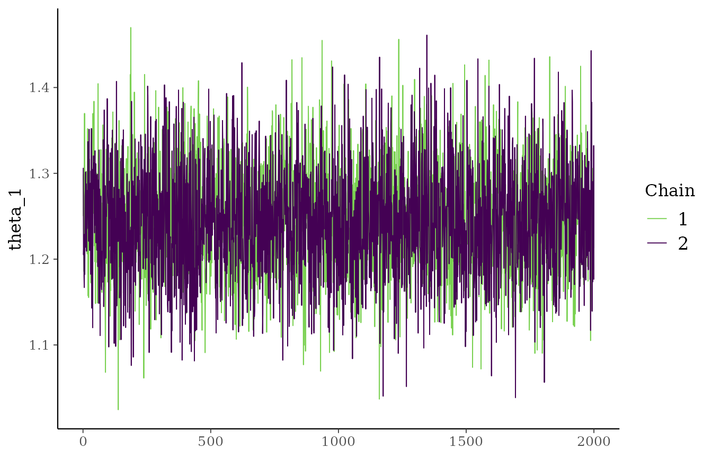
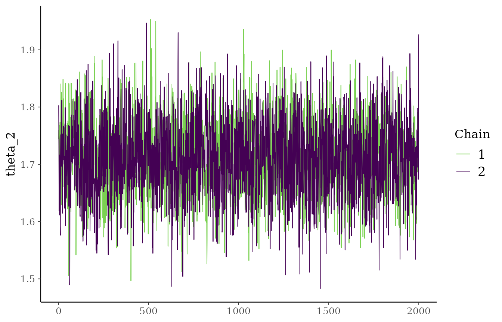
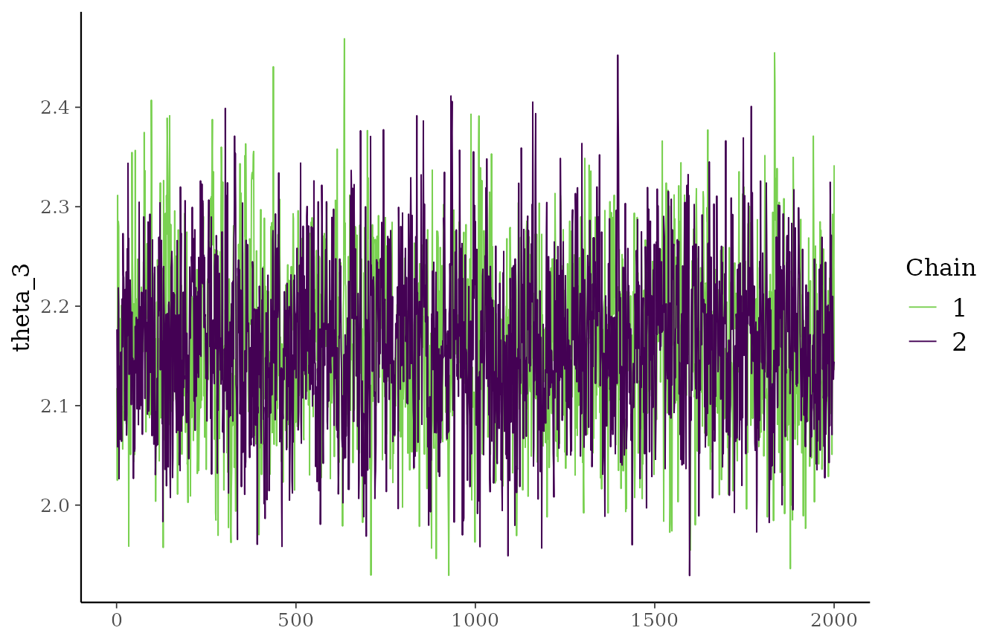
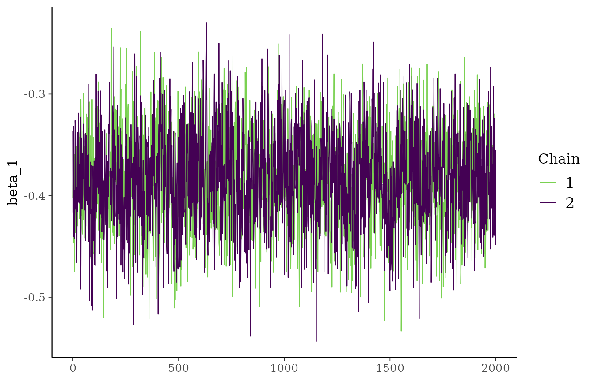
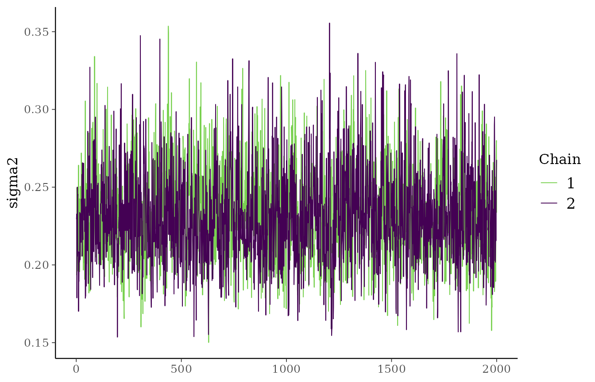
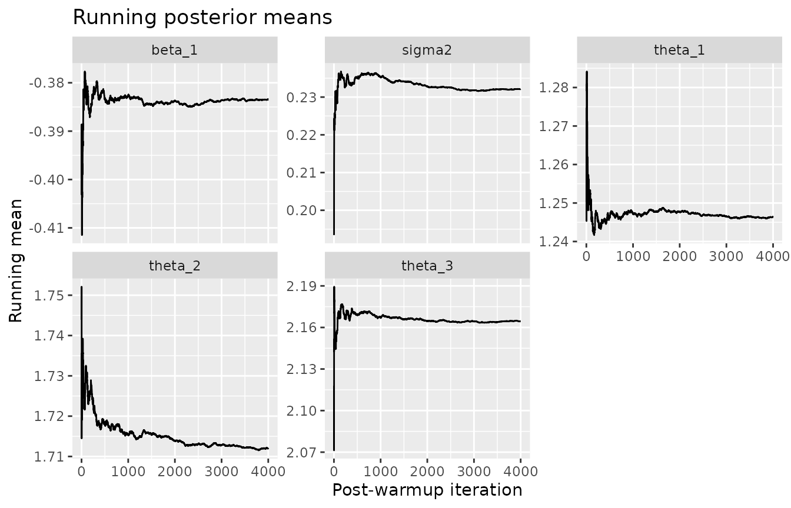

# Convergence and Diagnostics

## Overview

This vignette shows a simple workflow for checking whether the sampler
appears stable in practice. The package now supports multiple chains,
including R-level parallel execution, so the examples below combine:

- traceplots,
- running means,
- effective sample size approximations,
- repeated fits with different seeds.

## Simulate data

``` r

library(exnexSurv)
library(survival)
library(ggplot2)
library(bayesplot)

simulate_surv_data <- function(
  theta,
  sigma2,
  beta = NULL,
  n_per_group = 60,
  censor_min = 4,
  censor_max = 12,
  seed = NULL
) {
  if (!is.null(seed)) {
    set.seed(seed)
  }

  groups <- rep(seq_along(theta), each = n_per_group)
  age_std <- rnorm(length(groups), mean = 0, sd = 1)
  mean_log_time <- rep(theta, each = n_per_group)

  if (!is.null(beta)) {
    mean_log_time <- mean_log_time + beta * age_std
  }

  log_time <- rnorm(length(groups), mean = mean_log_time, sd = sqrt(sigma2))
  true_time <- exp(log_time)
  censor_time <- runif(length(groups), min = censor_min, max = censor_max)

  data.frame(
    time = pmin(true_time, censor_time),
    event = as.integer(true_time <= censor_time),
    group = factor(groups),
    age_std = age_std
  )
}

sim_data <- simulate_surv_data(
  theta = c(1.2, 1.7, 2.1),
  sigma2 = 0.20,
  beta = -0.35,
  n_per_group = 60,
  seed = 6841
)

mean(sim_data$event)
#> [1] 0.6777778
```

## Fit multiple chains

``` r

fit <- pooling_surv(
  Surv(time, event) ~ group + age_std,
  data = sim_data,
  iter = 3000,
  warmup = 1000,
  chains = 2,
  parallel_chains = TRUE,
  seed = 6841
)

print(fit, show_trace = FALSE)
#> <pooling_surv model>
#> Pooling: exnex 
#> Draws: 4000 total post-warmup samples
#>        2000 post-warmup samples per chain
#> Groups: 3 | Covariates: 1 
#> MCMC: iter = 3000 , warmup = 1000 , thin = 1 , chains = 2 
#> 
#>  parameter       mean         sd        q05        q50        q95      rhat
#>    theta_1  1.2463566 0.06462694  1.1403574  1.2466079  1.3532442 1.0002037
#>    theta_2  1.7120960 0.06780666  1.6006020  1.7114203  1.8234427 1.0005279
#>    theta_3  2.1643972 0.07989574  2.0348217  2.1631064  2.2992832 0.9998898
#>     beta_1 -0.3834375 0.04700082 -0.4604095 -0.3846512 -0.3059669 1.0000344
#>     sigma2  0.2321148 0.03015053  0.1875849  0.2298443  0.2862142 1.0004339
#>  ess_bulk ess_tail
#>  3458.452 3692.770
#>  2552.374 3345.889
#>  1617.838 2137.126
#>  1692.638 3002.280
#>  1746.595 2707.902
#> 
#> Convergence: max R-hat =    1 | min ESS = 1617.8
```

This fit stores all post-warmup draws in one table. With `chains = 2`,
each chain contributes the same number of post-warmup iterations, so
chain-aware diagnostics can reconstruct the original chain layout from
the total row count.

## Traceplots

``` r

plot(fit, ask = FALSE)
```



A healthy traceplot usually shows noisy fluctuations around a roughly
stable level rather than long drifts or very sticky behavior.

## Running means

``` r

running_mean_df <- do.call(
  rbind,
  lapply(colnames(fit$draws), function(param) {
    values <- fit$draws[[param]]
    data.frame(
      iteration = seq_along(values),
      running_mean = cumsum(values) / seq_along(values),
      parameter = param
    )
  })
)

ggplot(running_mean_df, aes(iteration, running_mean)) +
  geom_line() +
  facet_wrap(~ parameter, scales = "free_y") +
  labs(
    title = "Running posterior means",
    x = "Post-warmup iteration",
    y = "Running mean"
  )
```



If the running means stabilize, that is usually a good sign that Monte
Carlo error is shrinking.

## Simple numerical diagnostics

``` r

ess_simple <- function(x, max_lag = 100) {
  acf_vals <- stats::acf(
    x,
    lag.max = min(max_lag, length(x) - 1),
    plot = FALSE
  )$acf[-1]

  positive_acf <- acf_vals[acf_vals > 0]

  if (length(positive_acf) == 0) {
    return(length(x))
  }

  tau <- 1 + 2 * sum(positive_acf)
  min(length(x), length(x) / tau)
}

diagnostics <- data.frame(
  parameter = colnames(fit$draws),
  mean = colMeans(fit$draws),
  sd = apply(fit$draws, 2, sd),
  lag1_acf = apply(fit$draws, 2, function(x) stats::acf(x, lag.max = 1, plot = FALSE)$acf[2]),
  ess = apply(fit$draws, 2, ess_simple),
  mcse = mapply(function(s, e) s / sqrt(e), apply(fit$draws, 2, sd), apply(fit$draws, 2, ess_simple)),
  row.names = NULL
)

diagnostics
#>   parameter       mean         sd   lag1_acf      ess         mcse
#> 1   theta_1  1.2463566 0.06462694 0.07715308 1670.518 0.0015812045
#> 2   theta_2  1.7120960 0.06780666 0.17671633 1401.528 0.0018112211
#> 3   theta_3  2.1643972 0.07989574 0.36812889 1153.227 0.0023526984
#> 4    beta_1 -0.3834375 0.04700082 0.33138567 1187.507 0.0013639152
#> 5    sigma2  0.2321148 0.03015053 0.33885848 1020.186 0.0009439638
```

Lower autocorrelation and higher effective sample size are usually
preferable.

## Repeat the fit with different seeds

``` r

fit_seeds <- lapply(c(6841, 7313, 8129), function(seed) {
  pooling_surv(
    Surv(time, event) ~ group + age_std,
    data = sim_data,
    iter = 3000,
    warmup = 1000,
    chains = 2,
    parallel_chains = TRUE,
    seed = seed
  )
})

posterior_means_by_run <- do.call(
  rbind,
  lapply(fit_seeds, function(x) {
    s <- summary(x)
    stats::setNames(s$mean, s$parameter)
  })
)

posterior_means_by_run
#>       theta_1  theta_2  theta_3     beta_1    sigma2
#> [1,] 1.246357 1.712096 2.164397 -0.3834375 0.2321148
#> [2,] 1.243725 1.711442 2.161590 -0.3829936 0.2310015
#> [3,] 1.245225 1.710733 2.162179 -0.3825527 0.2325135
apply(posterior_means_by_run, 2, sd)
#>      theta_1      theta_2      theta_3       beta_1       sigma2 
#> 0.0013202950 0.0006818794 0.0014800891 0.0004424412 0.0007836361
```

If posterior means are very similar across runs, that supports
stability.

## Interpretation

These diagnostics are practical checks, not formal proofs of
convergence. Still, when traceplots look stable, running means flatten
out, and repeated runs give similar posterior summaries, the fit is
usually behaving reasonably well.
