# Getting Started with exnexSurv

## Overview

`exnexSurv` fits Bayesian pooling models for right-censored log-normal
data: the EXNEX hierarchy (`pooling = "exnex"`, the default), complete
pooling (`pooling = "complete"`), and no pooling (`pooling = "none"`).
See the *Model and Methods* vignette for details. The current interface
supports:

- a formula interface,
- an `x`/`y` interface,
- subgroup effects,
- optional covariates,
- posterior draws for `theta_j`, `beta`, and `sigma2`.

## Simulate a simple dataset

``` r

library(exnexSurv)
library(survival)

simulate_surv_data <- function(
  theta,
  sigma2,
  beta = NULL,
  n_per_group = 50,
  censor_min = 4,
  censor_max = 12,
  seed = NULL
) {
  if (!is.null(seed)) {
    set.seed(seed)
  }

  groups <- rep(seq_along(theta), each = n_per_group)
  age_std <- rnorm(length(groups), mean = 0, sd = 1)
  mean_log_time <- rep(theta, each = n_per_group)

  if (!is.null(beta)) {
    mean_log_time <- mean_log_time + beta * age_std
  }

  log_time <- rnorm(length(groups), mean = mean_log_time, sd = sqrt(sigma2))
  true_time <- exp(log_time)
  censor_time <- runif(length(groups), min = censor_min, max = censor_max)

  data.frame(
    time = pmin(true_time, censor_time),
    event = as.integer(true_time <= censor_time),
    group = factor(groups),
    age_std = age_std
  )
}

sim_data <- simulate_surv_data(
  theta = c(1.1, 1.6, 2.0),
  sigma2 = 0.25,
  beta = -0.30,
  n_per_group = 50,
  seed = 6421
)

head(sim_data)
#>       time event group    age_std
#> 1 3.339087     1     1  0.6071040
#> 2 3.330683     1     1 -1.1474496
#> 3 2.469950     1     1 -0.5987154
#> 4 4.277826     1     1 -1.6561367
#> 5 2.422691     1     1  0.8235441
#> 6 2.831290     1     1  0.5040783
mean(sim_data$event)
#> [1] 0.7866667
```

## Fit the model with a formula

``` r

fit_formula <- pooling_surv(
  Surv(time, event) ~ group + age_std,
  data = sim_data,
  iter = 1200,
  warmup = 400,
  chains = 1,
  seed = 6421
)

print(fit_formula, show_trace = FALSE)
#> <pooling_surv model>
#> Pooling: exnex 
#> Draws: 800 total post-warmup samples
#>        800 post-warmup samples per chain
#> Groups: 3 | Covariates: 1 
#> MCMC: iter = 1200 , warmup = 400 , thin = 1 , chains = 1 
#> 
#>  parameter       mean         sd        q05        q50        q95      rhat
#>    theta_1  0.9861505 0.06849275  0.8788059  0.9862140  1.0958766 0.9993574
#>    theta_2  1.5326028 0.07082872  1.4121900  1.5318814  1.6524219 0.9990455
#>    theta_3  1.9841454 0.07555761  1.8632978  1.9833107  2.1082712 1.0055107
#>     beta_1 -0.3075793 0.04281121 -0.3797194 -0.3074616 -0.2362734 1.0084968
#>     sigma2  0.2347691 0.03216346  0.1856459  0.2331866  0.2883242 1.0003663
#>  ess_bulk ess_tail
#>  768.5948 597.2774
#>  459.6751 582.4569
#>  451.6547 533.8496
#>  321.3371 497.4946
#>  553.2356 727.2810
#> 
#> Convergence: max R-hat = 1.01 | min ESS = 321.3
summary(fit_formula)
#>   parameter       mean         sd        q05        q50        q95      rhat
#> 1   theta_1  0.9861505 0.06849275  0.8788059  0.9862140  1.0958766 0.9993574
#> 2   theta_2  1.5326028 0.07082872  1.4121900  1.5318814  1.6524219 0.9990455
#> 3   theta_3  1.9841454 0.07555761  1.8632978  1.9833107  2.1082712 1.0055107
#> 4    beta_1 -0.3075793 0.04281121 -0.3797194 -0.3074616 -0.2362734 1.0084968
#> 5    sigma2  0.2347691 0.03216346  0.1856459  0.2331866  0.2883242 1.0003663
#>   ess_bulk ess_tail
#> 1 768.5948 597.2774
#> 2 459.6751 582.4569
#> 3 451.6547 533.8496
#> 4 321.3371 497.4946
#> 5 553.2356 727.2810
```

The fitted object stores the processed data, posterior draws, and MCMC
settings. You can inspect the model structure with the usual S3 methods.

## Run multiple chains in parallel

``` r

fit_parallel <- pooling_surv(
  Surv(time, event) ~ group + age_std,
  data = sim_data,
  iter = 1200,
  warmup = 400,
  chains = 2,
  parallel_chains = TRUE,
  seed = 6421
)

print(fit_parallel, show_trace = FALSE)
#> <pooling_surv model>
#> Pooling: exnex 
#> Draws: 1600 total post-warmup samples
#>        800 post-warmup samples per chain
#> Groups: 3 | Covariates: 1 
#> MCMC: iter = 1200 , warmup = 400 , thin = 1 , chains = 2 
#> 
#>  parameter       mean         sd        q05        q50        q95      rhat
#>    theta_1  0.9870040 0.06958675  0.8748666  0.9858982  1.0979172 0.9995272
#>    theta_2  1.5334538 0.07136513  1.4126375  1.5335034  1.6516964 0.9997952
#>    theta_3  1.9815311 0.07540195  1.8590322  1.9798331  2.1025855 1.0005217
#>     beta_1 -0.3047351 0.04333179 -0.3782277 -0.3047538 -0.2341006 1.0038610
#>     sigma2  0.2337765 0.03210020  0.1862492  0.2316788  0.2892194 1.0002698
#>  ess_bulk ess_tail
#>  1615.809 1334.522
#>  1062.443 1235.490
#>   929.403 1270.271
#>   855.130 1209.172
#>  1078.190 1459.379
#> 
#> Convergence: max R-hat =    1 | min ESS = 855.1
plot(
  fit_parallel,
  parameters = c("theta_1", "theta_2", "theta_3", "beta_1", "sigma2"),
  ask = FALSE
)
```

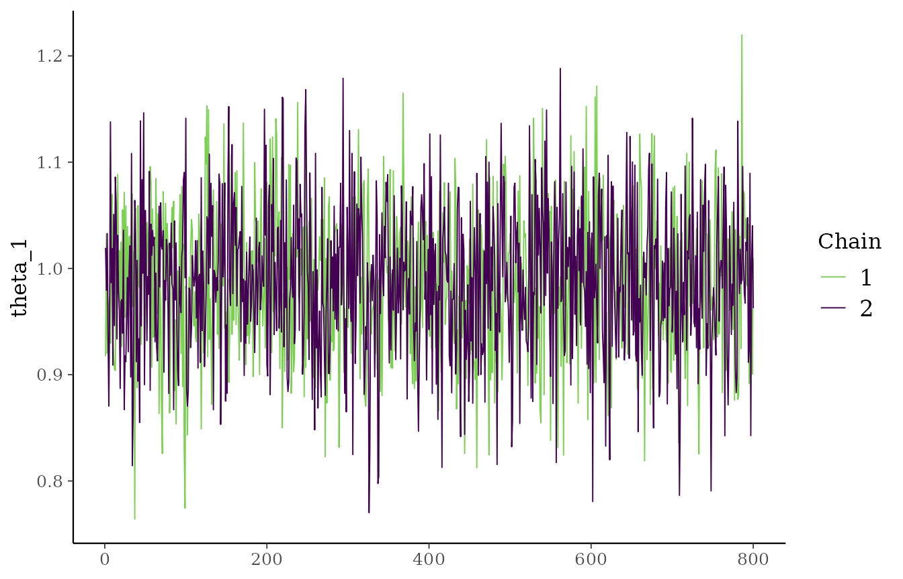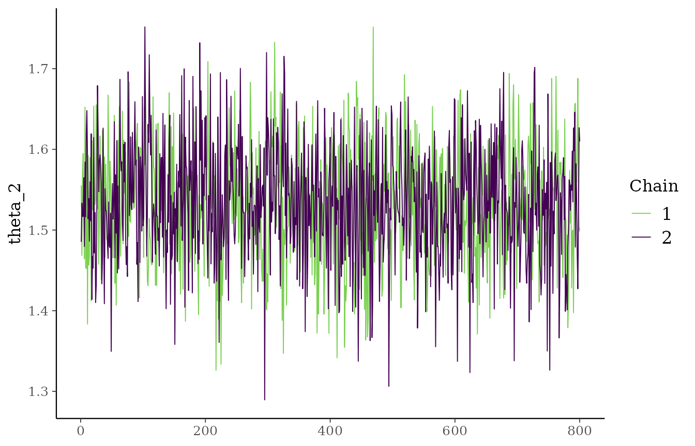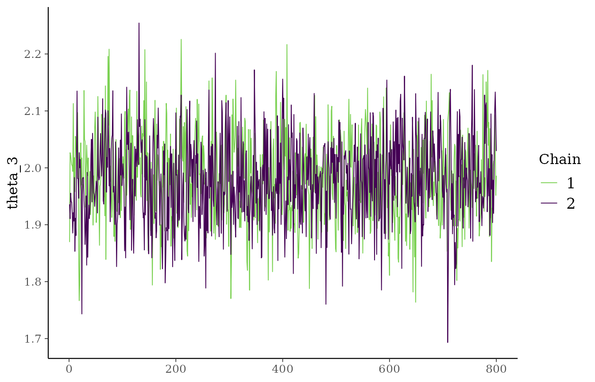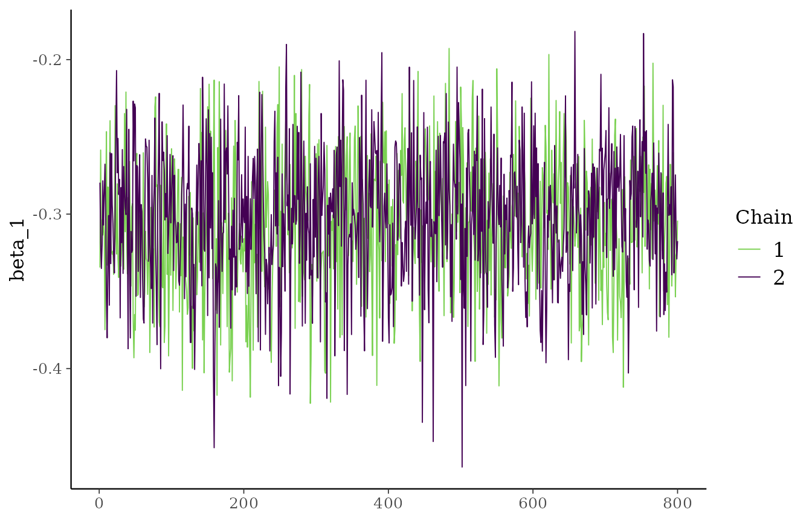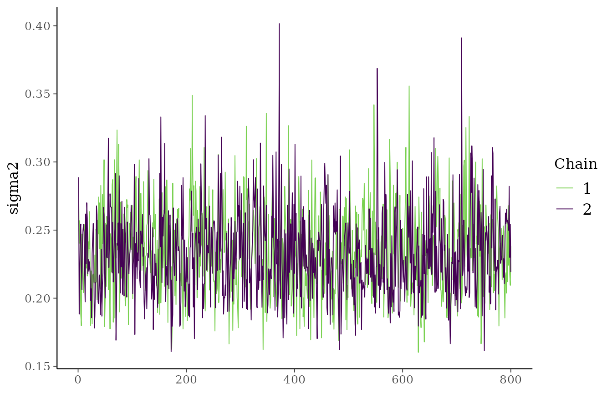

When `parallel_chains = TRUE`, all chains are evaluated concurrently on
background R sessions (through the `future` framework) and the
traceplots show all chains in the same panel for each parameter.

With `verbose = TRUE` a live progress bar (`progressr`) updates while
the chains run, in both sequential and parallel execution.

The fitted object stores the combined post-warmup draws from all chains
in one table. Because each chain contributes the same number of
post-warmup samples, the total number of rows is
`ceiling((iter - warmup) / thin) * chains`. The `thin` argument keeps
every `thin`-th post-warmup draw (default `1`, keep all), which reduces
memory and posterior autocorrelation without changing the sampler.

``` r

str(fit_formula$data)
#> List of 9
#>  $ time        : num [1:150] 3.34 3.33 2.47 4.28 2.42 ...
#>  $ event       : num [1:150] 1 1 1 1 1 1 1 1 1 1 ...
#>  $ group       : num [1:150] 1 1 1 1 1 1 1 1 1 1 ...
#>  $ X           : num [1:150, 1] 0.607 -1.147 -0.599 -1.656 0.824 ...
#>   ..- attr(*, "dimnames")=List of 2
#>   .. ..$ : NULL
#>   .. ..$ : chr "age_std"
#>  $ n           : int 150
#>  $ n_groups    : num 3
#>  $ n_covariates: int 1
#>  $ cov_names   : chr "age_std"
#>  $ chain_seeds : int 979729617
plot(
  fit_formula,
  parameters = c("theta_1", "theta_2", "sigma2"),
  ask = FALSE
)
```

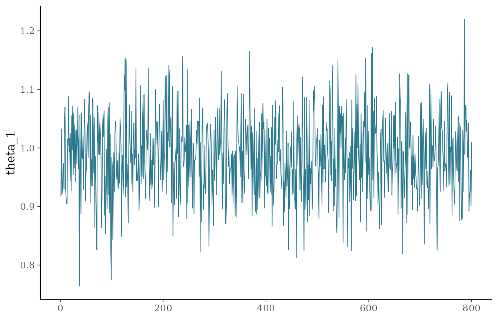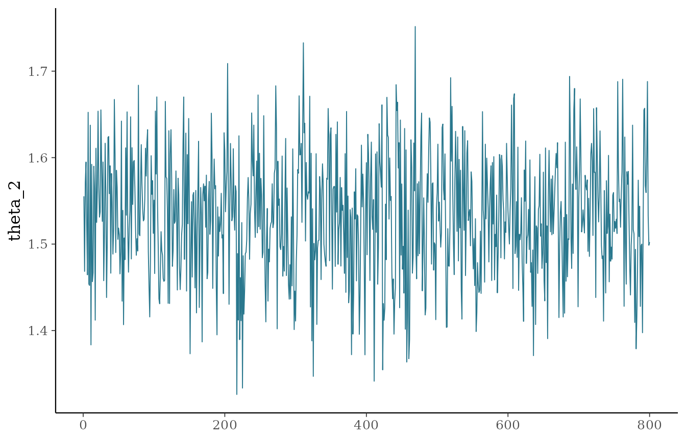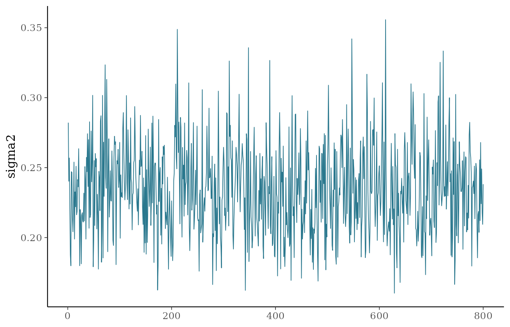

## Fit the model with `x` and `y`

``` r

fit_xy <- pooling_surv(
  x = sim_data[c("group", "age_std")],
  y = Surv(sim_data$time, sim_data$event),
  iter = 1200,
  warmup = 400,
  chains = 1,
  seed = 6421
)

summary(fit_xy)
#>   parameter       mean         sd        q05        q50        q95      rhat
#> 1   theta_1  0.9861505 0.06849275  0.8788059  0.9862140  1.0958766 0.9993574
#> 2   theta_2  1.5326028 0.07082872  1.4121900  1.5318814  1.6524219 0.9990455
#> 3   theta_3  1.9841454 0.07555761  1.8632978  1.9833107  2.1082712 1.0055107
#> 4    beta_1 -0.3075793 0.04281121 -0.3797194 -0.3074616 -0.2362734 1.0084968
#> 5    sigma2  0.2347691 0.03216346  0.1856459  0.2331866  0.2883242 1.0003663
#>   ess_bulk ess_tail
#> 1 768.5948 597.2774
#> 2 459.6751 582.4569
#> 3 451.6547 533.8496
#> 4 321.3371 497.4946
#> 5 553.2356 727.2810
all.equal(fit_formula$draws, fit_xy$draws)
#> [1] TRUE
```

This is useful if predictors and outcomes are prepared separately.

## Fit a model without covariates

If the model only contains the subgroup variable, no `beta` terms are
estimated.

``` r

fit_no_cov <- pooling_surv(
  Surv(time, event) ~ group,
  data = sim_data,
  iter = 1200,
  warmup = 400,
  chains = 1,
  seed = 6421
)

summary(fit_no_cov)
#>   parameter      mean         sd       q05       q50       q95      rhat
#> 1   theta_1 0.9610428 0.07667525 0.8240873 0.9646688 1.0782239 0.9999338
#> 2   theta_2 1.5114113 0.08415282 1.3716898 1.5122529 1.6479938 1.0007384
#> 3   theta_3 1.9543858 0.08866337 1.8051221 1.9554501 2.0994038 0.9999588
#> 4    sigma2 0.3194790 0.04445914 0.2526799 0.3156426 0.4000848 1.0029710
#>   ess_bulk ess_tail
#> 1 753.9749 762.1476
#> 2 651.1591 641.7757
#> 3 429.1694 610.9976
#> 4 452.9197 683.4747
plot(fit_no_cov, ask = FALSE)
```

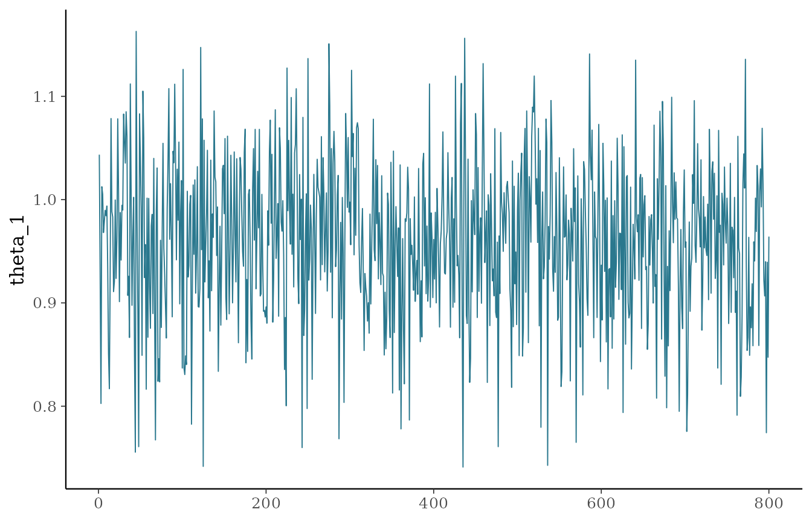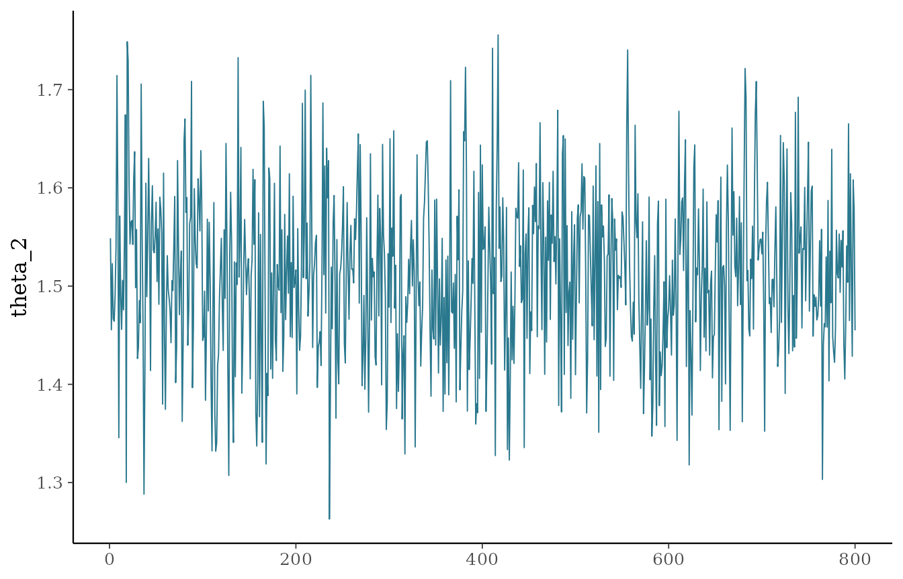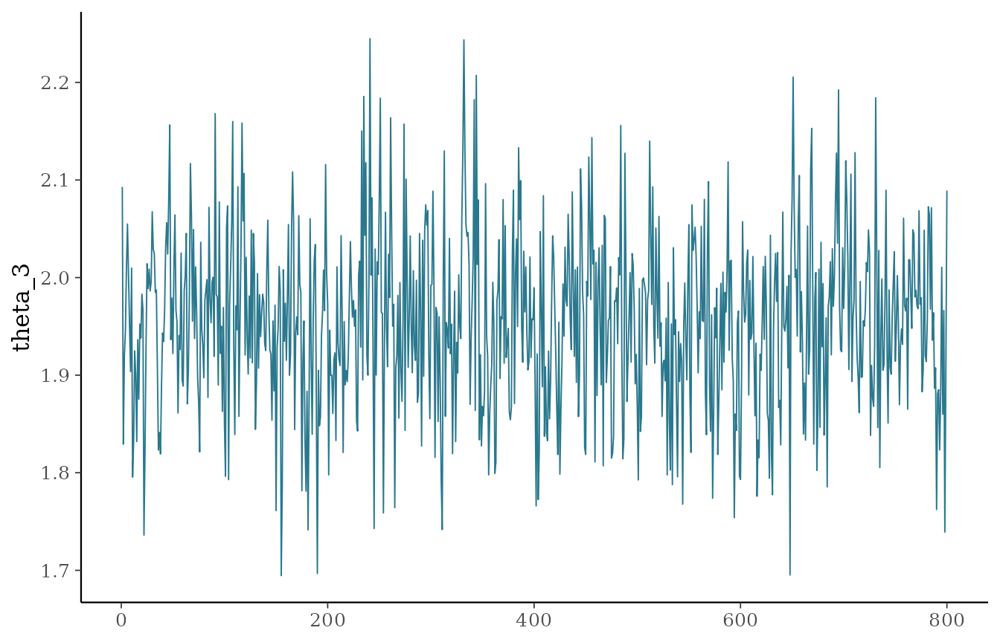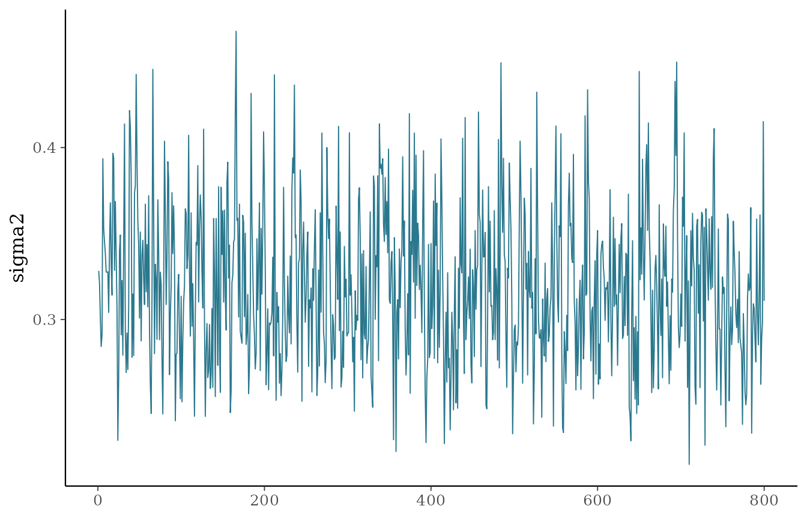

## Basic posterior summaries

``` r

summary(fit_formula)
#>   parameter       mean         sd        q05        q50        q95      rhat
#> 1   theta_1  0.9861505 0.06849275  0.8788059  0.9862140  1.0958766 0.9993574
#> 2   theta_2  1.5326028 0.07082872  1.4121900  1.5318814  1.6524219 0.9990455
#> 3   theta_3  1.9841454 0.07555761  1.8632978  1.9833107  2.1082712 1.0055107
#> 4    beta_1 -0.3075793 0.04281121 -0.3797194 -0.3074616 -0.2362734 1.0084968
#> 5    sigma2  0.2347691 0.03216346  0.1856459  0.2331866  0.2883242 1.0003663
#>   ess_bulk ess_tail
#> 1 768.5948 597.2774
#> 2 459.6751 582.4569
#> 3 451.6547 533.8496
#> 4 321.3371 497.4946
#> 5 553.2356 727.2810
```

## Inspecting the resolved priors

Whatever you pass to `priors`, the fitted object records the exact
hyperparameters the sampler used, with defaults merged into the fields
you did not supply. This is useful to confirm your customization was
applied and to reproduce a fit.

``` r

fit_formula$resolved_priors
#> $a_sigma
#> [1] 2
#> 
#> $b_sigma
#> [1] 2
#> 
#> $a_tau
#> [1] 2
#> 
#> $b_tau
#> [1] 2
#> 
#> $p_mix
#> [1] 0.5
#> 
#> $m_mu
#> [1] 0
#> 
#> $v_mu
#> [1] 10000
#> 
#> $m_nex
#> [1] 0
#> 
#> $v_nex
#> [1] 10000
#> 
#> $v_beta
#> [1] 10000
```

To customize a prior, pass a named list to `priors`; for example,
`priors = list(p_mix = 0.7, a_tau = 3, b_tau = 3)`. The fields `p_mix`,
`m_nex`, and `v_nex` also accept a vector of length equal to the number
of baskets, assigning one value per basket. See the vignette *The EXNEX
Model, Priors, and Data Augmentation* for the full list of
hyperparameters and how to set them.

## Notes

The current implementation supports multiple chains, including R-level
concurrent execution through `parallel_chains = TRUE`. For a more
careful convergence check, fit more than one chain and compare the
traceplots and posterior summaries across chains.
