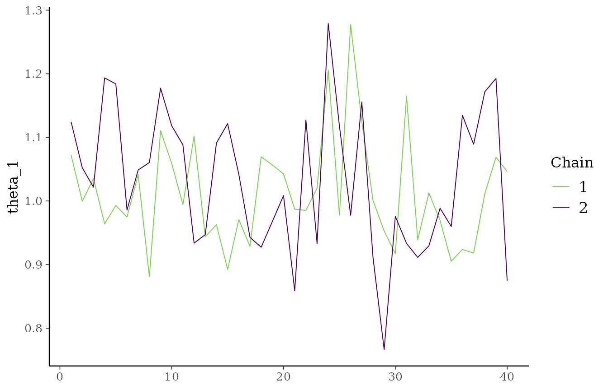
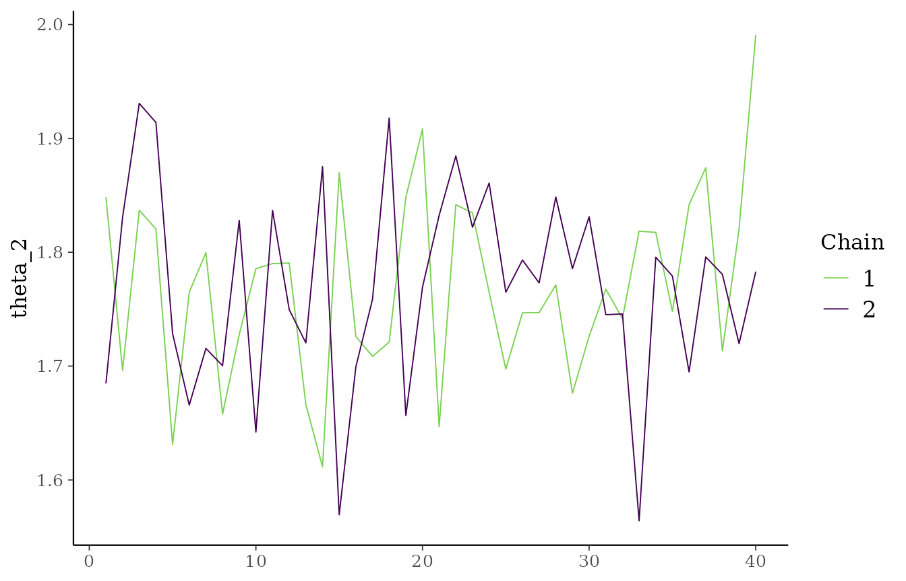
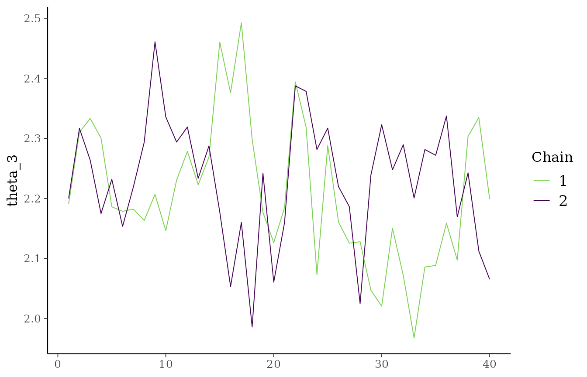
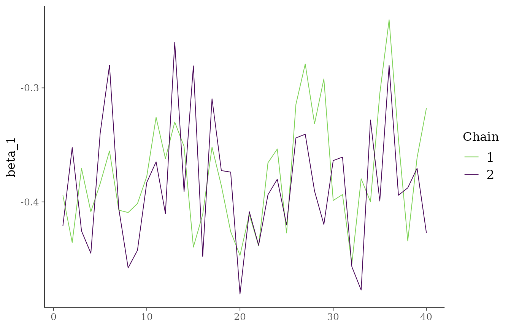
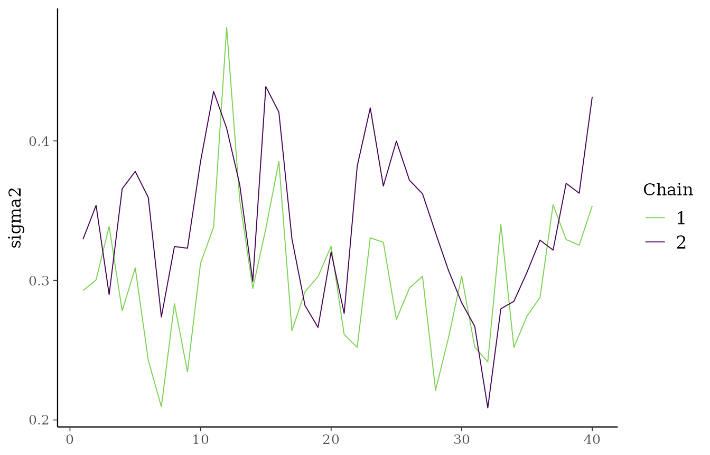

# Running Chains in Parallel

## Overview

`exnexSurv` can run multiple independent MCMC chains and, when
requested, distribute them across R-level parallel workers. The C++
sampler still handles one chain per call; the R bridge coordinates the
chain loop and combines the post-warmup draws.

Use:

- `chains` for the total number of independent chains,
- `parallel_chains` for how many chains to run concurrently.

`parallel_chains` must be less than or equal to `chains`.

## Simulate data

``` r

library(exnexSurv)
library(survival)

simulate_surv_data <- function(
  theta,
  sigma2,
  beta = NULL,
  n_per_group = 40,
  censor_min = 4,
  censor_max = 12,
  seed = NULL
) {
  if (!is.null(seed)) {
    set.seed(seed)
  }

  groups <- rep(seq_along(theta), each = n_per_group)
  age_std <- rnorm(length(groups))
  mean_log_time <- rep(theta, each = n_per_group)

  if (!is.null(beta)) {
    mean_log_time <- mean_log_time + beta * age_std
  }

  log_time <- rnorm(length(groups), mean = mean_log_time, sd = sqrt(sigma2))
  true_time <- exp(log_time)
  censor_time <- runif(length(groups), min = censor_min, max = censor_max)

  data.frame(
    time = pmin(true_time, censor_time),
    event = as.integer(true_time <= censor_time),
    group = factor(groups),
    age_std = age_std
  )
}

sim_data <- simulate_surv_data(
  theta = c(1.0, 1.6, 2.1),
  sigma2 = 0.25,
  beta = -0.30,
  seed = 9201
)
```

## Fit two chains in parallel

``` r

fit_parallel <- exnex_surv(
  Surv(time, event) ~ group + age_std,
  data = sim_data,
  iter = 60,
  warmup = 20,
  chains = 2,
  parallel_chains = 2,
  seed = 9201
)

print(fit_parallel, show_trace = FALSE)
#> <exnex_surv model>
#> Draws: 80 total post-warmup samples
#>        40 post-warmup samples per chain
#> Groups: 3 | Covariates: 1 
#> MCMC: iter = 60 , warmup = 20 , chains = 2 
#> 
#>  parameter       mean         sd        q05        q50        q95
#>    theta_1  1.0228722 0.09968104  0.8918244  1.0047708  1.1926777
#>    theta_2  1.7698594 0.08266481  1.6414429  1.7703639  1.9085733
#>    theta_3  2.2190697 0.11007270  2.0460476  2.2195088  2.3877982
#>     beta_1 -0.3805380 0.05226572 -0.4544758 -0.3867217 -0.2803758
#>     sigma2  0.3204454 0.05609064  0.2412223  0.3210869  0.4240346
```

The fitted object stores the combined post-warmup draws from both
chains. If you used `iter = 60` and `warmup = 20` with `chains = 2`, the
posterior sample table contains `80` rows in total, or `40` rows per
chain.

## Fit more chains than workers

``` r

fit_four_chains <- exnex_surv(
  Surv(time, event) ~ group + age_std,
  data = sim_data,
  iter = 60,
  warmup = 20,
  chains = 4,
  parallel_chains = 2,
  seed = 9201
)

print(fit_four_chains, show_trace = FALSE)
#> <exnex_surv model>
#> Draws: 160 total post-warmup samples
#>        40 post-warmup samples per chain
#> Groups: 3 | Covariates: 1 
#> MCMC: iter = 60 , warmup = 20 , chains = 4 
#> 
#>  parameter       mean         sd        q05        q50        q95
#>    theta_1  1.0167982 0.09221235  0.8949872  1.0046741  1.1821268
#>    theta_2  1.7741504 0.09281588  1.6301872  1.7726403  1.9159255
#>    theta_3  2.2131117 0.11246031  2.0201792  2.2212840  2.3811103
#>     beta_1 -0.3804203 0.05388983 -0.4628156 -0.3854931 -0.2754689
#>     sigma2  0.3114648 0.05345781  0.2313879  0.3058044  0.4207686
```

This runs four independent chains while scheduling only two workers at a
time.

## Traceplots with all chains

``` r

plot(
  fit_parallel,
  parameters = c("theta_1", "theta_2", "theta_3", "beta_1", "sigma2"),
  ask = FALSE
)
```



Each parameter panel shows all chains together, which makes it easier to
compare mixing and overlap across chains.

## Compare to sequential execution

``` r

fit_sequential <- exnex_surv(
  Surv(time, event) ~ group + age_std,
  data = sim_data,
  iter = 60,
  warmup = 20,
  chains = 2,
  parallel_chains = 1,
  seed = 9201
)

identical(fit_parallel$draws, fit_sequential$draws)
#> [1] TRUE
```

Changing `parallel_chains` affects only how the chains are scheduled,
not the model itself.

## Practical notes

If you want to run more chains than you want to evaluate concurrently,
set `parallel_chains` smaller than `chains`. That is useful when the
sampler is expensive or when you want to avoid using all available cores
at once.
