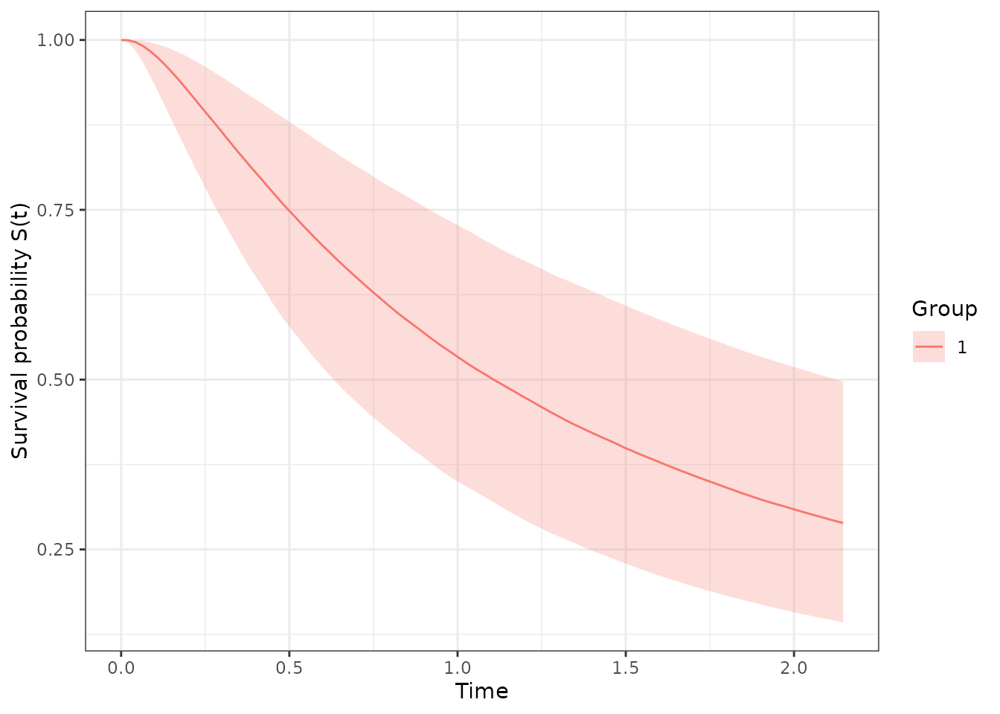

# Tools for Experimenters

Beyond fitting, `exnexSurv` provides a small set of inference and
model-selection utilities that operate directly on the posterior draws
already stored in a fitted `pooling_surv` object. This vignette walks
through each of them using a small simulated example.

## A quick simulated example

We first generate a basket-trial dataset with
[`simulate_data()`](https://victorney.github.io/exnexSurv/reference/simulate_data.md).
By default it creates `K = 9` baskets with `n = 30` patients each, a
single covariate, and lets us flag some baskets as “resistant” (their
location is shifted away from the healthy population) — exactly the
situation the EXNEX model is designed to handle.

``` r

library(exnexSurv)
library(survival)

set.seed(42)
d <- simulate_data(
  n = 20,
  beta = 0.5,
  sigma = 1.1,
  outlier_baskets = c(2, 8),
  resist_delta = -1.0,
  censoring_rate = 0.3,
  seed = 1
)

head(d)
#>         time event group         x1
#> 1 0.18911694     0     1 -0.3053884
#> 2 0.09337518     0     1  1.5117812
#> 3 0.76338340     0     1  0.3898432
#> 4 0.29834303     1     1 -0.6212406
#> 5 0.74983093     1     1 -2.2146999
#> 6 0.42299553     1     1  1.1249309
```

The dataset stores the true generating parameters as attributes:

``` r

attr(d, "true_theta")
#> [1] -0.09396807 -0.97245350 -0.12534429  0.23929212  0.04942617 -0.12307026
#> [7]  0.07311436 -0.88925129  0.08636720
attr(d, "true_beta")
#> [1] 0.5
attr(d, "true_sigma")
#> [1] 1.1
```

Now fit the model. We keep the chain short so the vignette builds
quickly; for real work use more iterations and multiple chains.

``` r

fit <- pooling_surv(
  Surv(time, event) ~ group + x1,
  data = d,
  iter = 2000,
  warmup = 1000,
  chains = 2,
  seed = 7
)
print(fit, show_trace = FALSE)
#> <pooling_surv model>
#> Pooling: exnex 
#> Draws: 2000 total post-warmup samples
#>        1000 post-warmup samples per chain
#> Groups: 9 | Covariates: 1 
#> MCMC: iter = 2000 , warmup = 1000 , chains = 2 
#> 
#>  parameter        mean        sd        q05         q50        q95      rhat
#>    theta_1  0.11669485 0.3069765 -0.3559653  0.10164526  0.6594590 0.9999671
#>    theta_2 -0.93329406 0.2705633 -1.3614140 -0.94103137 -0.4745091 0.9997708
#>    theta_3 -0.39262307 0.3118125 -0.8972846 -0.39517207  0.1279407 0.9998223
#>    theta_4  0.32611057 0.3096740 -0.1786917  0.31792317  0.8508286 1.0000792
#>    theta_5 -0.06263464 0.2780822 -0.5129246 -0.07036695  0.3991122 1.0007271
#>    theta_6  0.18591764 0.3207427 -0.3435120  0.18593333  0.7207398 1.0013532
#>    theta_7  0.22624399 0.3367305 -0.3136029  0.22118365  0.7945553 1.0036246
#>    theta_8 -0.81203876 0.2875932 -1.2800821 -0.81498863 -0.3578141 1.0004449
#>    theta_9 -0.01260007 0.3443596 -0.5723189 -0.02049141  0.5682546 0.9999890
#>     beta_1  0.58664689 0.1243464  0.3808375  0.58879860  0.7866019 1.0003532
#>     sigma2  1.45675160 0.2336813  1.1254281  1.43078082  1.8681451 1.0014806
#>   ess_bulk  ess_tail
#>   985.1951 1360.9958
#>  1294.0195 1808.7330
#>   941.3412 1275.7780
#>  1052.4902 1358.4968
#>  1113.2750 1298.6132
#>   841.7601 1464.7546
#>   681.1668 1130.6408
#>  1182.8063 1608.6092
#>   679.8265 1141.9648
#>   793.1829 1221.2555
#>   460.6929  755.8611
#> 
#> Convergence: max R-hat =    1 | min ESS = 460.7
```

## Survival curves

[`survival_curves()`](https://victorney.github.io/exnexSurv/reference/survival_curves.md)
evaluates the posterior survival function $`S(t) = \Pr(T > t)`$ on a
time grid, returning a data frame with the posterior median and a
credible band:

``` r

curves <- survival_curves(fit)
#> Warning: More than one group present (1, 2, 3, 4, 5, 6, 7, 8, 9). Only the
#> first group '1' is used. Supply `newdata` with a `group` column to evaluate
#> specific groups.
head(curves)
#>         time    median     lower     upper group
#> 1 0.00000000 1.0000000 1.0000000 1.0000000     1
#> 2 0.02167666 0.9995105 0.9961272 0.9999611     1
#> 3 0.04335333 0.9966598 0.9837442 0.9995352     1
#> 4 0.06502999 0.9911528 0.9664658 0.9983715     1
#> 5 0.08670666 0.9834503 0.9459817 0.9963951     1
#> 6 0.10838332 0.9741849 0.9252277 0.9936357     1
```

[`plot.survival_exnex()`](https://victorney.github.io/exnexSurv/reference/plot.survival_exnex.md)
draws the curves (requires `ggplot2`):

``` r

plot(curves)
```



By default a single curve is produced with covariates fixed at zero.
Passing `newdata` evaluates one row per subject with its own covariate
values and group:

``` r

nd <- data.frame(group = d$group[1:3], x1 = c(0, 0.2, -0.1))
curves_nd <- survival_curves(fit, newdata = nd)
table(curves_nd$group)
#> 
#>   1   2   3 
#> 100 100 100
```

## Posterior median survival time

For the log-normal AFT model the median survival time of a linear
predictor $`\eta`$ is simply $`\exp(\eta)`$.
[`median_survival()`](https://victorney.github.io/exnexSurv/reference/median_survival.md)
reports its posterior quantiles with credible intervals:

``` r

median_survival(fit)
#> Warning: More than one group present (1, 2, 3, 4, 5, 6, 7, 8, 9). Only the
#> first group '1' is used. Supply `newdata` with a `group` column to evaluate
#> specific groups.
#>     group   median     lower    upper
#> 50%     1 1.106991 0.6315226 2.126547
```

## Restricted mean survival time (RMST)

[`rmst()`](https://victorney.github.io/exnexSurv/reference/rmst.md)
computes $`\mathrm{RMST}(t_{max}) = \int_0^{t_{max}} S(t)\,dt`$ for each
posterior draw and summarises the distribution:

``` r

rmst(fit, tmax = 10)
#> Warning: More than one group present (1, 2, 3, 4, 5, 6, 7, 8, 9). Only the
#> first group '1' is used. Supply `newdata` with a `group` column to evaluate
#> specific groups.
#>     group     rmst    lower    upper
#> 50%     1 2.000315 1.177118 3.416444
```

## Model comparison with WAIC

[`compute_waic()`](https://victorney.github.io/exnexSurv/reference/compute_waic.md)
evaluates the pointwise log-likelihood of the observed data (here the
censoring contribution is handled explicitly), giving WAIC, its standard
error, the log pointwise predictive density (`lpd`) and the penalty
`p_waic`:

``` r

w <- compute_waic(fit)
str(w[c("waic", "se_elpd_waic", "lpd", "p_waic", "elpd_waic")])
#> List of 5
#>  $ waic        : num 185
#>  $ se_elpd_waic: num 7.61
#>  $ lpd         : num -83.2
#>  $ p_waic      : num 9.54
#>  $ elpd_waic   : num -92.7
```

[`compare_waic()`](https://victorney.github.io/exnexSurv/reference/compare_waic.md)
contrasts several fits (e.g. a full model vs. a group-only model) and
returns them ordered by ascending WAIC:

``` r

fit_group <- pooling_surv(
  Surv(time, event) ~ group,
  data = d,
  iter = 2000, warmup = 1000, chains = 2, seed = 7
)

compare_waic(without_covariate = fit_group, with_covariate = fit)
#>               model   waic se_elpd_waic       lpd   p_waic elpd_waic
#> 1    with_covariate 185.48         7.61 -83.19976 9.538642  -92.7384
#> 2 without_covariate 208.14         6.64 -95.30619 8.762752 -104.0689
```

## Probability that one group beats another

[`probability_superiority()`](https://victorney.github.io/exnexSurv/reference/probability_superiority.md)
estimates $`\Pr(\mathrm{summ}_a > \mathrm{summ}_b)`$ draw-by-draw for
one of three summaries: median survival, survival probability at a fixed
time, or RMST.

``` r

# Median survival
probability_superiority(fit, a = 1, b = 3, function_of = "median")
#> $prob
#> [1] 0.881
#> 
#> $summary
#> [1] "median"
#> 
#> $groups
#> a b 
#> 1 3

# Survival probability at t = 3
probability_superiority(fit, a = 1, b = 2, function_of = "survival", times = 3)
#> $prob
#> [1] 0.9955
#> 
#> $summary
#> [1] "survival"
#> 
#> $groups
#> a b 
#> 1 2

# RMST up to t = 10
probability_superiority(fit, a = 1, b = 2, function_of = "rmst", tmax = 10)
#> $prob
#> [1] 0.9955
#> 
#> $summary
#> [1] "rmst"
#> 
#> $groups
#> a b 
#> 1 2
```

In this example baskets 1 and 3 are both healthy (only 2 and 8 are
resistant), so
[`probability_superiority()`](https://victorney.github.io/exnexSurv/reference/probability_superiority.md)
comparing them has no reason to prefer one over the other and returns a
probability close to 0.5. The exact numbers will vary with the simulated
data and the MCMC run.
